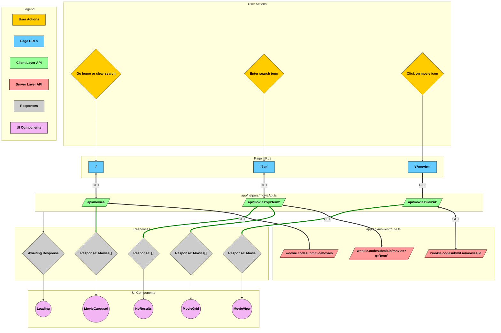

# Wookie Movies

Welcome to Wookie Movies, Kashyyyk's premier destination for seeing what Humans watch in their spare time.

Sit back and enjoy the ride (after some initial configuration).

## Getting Started

Before starting, ensure you have the latest version of [Node.js](https://nodejs.org/en) installed, which should
include [npm](https://docs.npmjs.com/)
by default.

To begin, change your current directory to the project directory

```bash
cd wookie-movies
```

Ensure your ```.env.local``` file has the following variables:

```code
API_BASE_URL=
API_ACCESS_KEY=
```

Install the package dependencies using

```bash
npm install
```

Finally, run the dev server

```bash
npm run dev
```

Open [http://localhost:3000](http://localhost:3000) with your browser to see the result.

## Testing

This project uses the [Jest](https://jestjs.io/) testing framework

Run tests from the project directory

```bash
npm run test
```

OR use the following for coverage reporting

```bash
npm run test:coverage
```

## Design Overview

- React Framework: [Next.js](https://nextjs.org/docs) App router implemented
  in [TypeScript](https://www.typescriptlang.org/docs/)
- Styling Framework: [SASS](https://sass-lang.com/documentation/)
  in [CSS Modules](https://github.com/css-modules/css-modules)
- Testing Framework: [Jest](https://jestjs.io/)

## Architecture Diagram



This flowchart outlines the architecture of a movie search and details retrieval system built with a client-server
model. The system follows these key components:

1. User Actions: Users can navigate the application by going home, searching for movies, or selecting a movie.
2. Page URLs: Based on user interactions, the application updates the URL to reflect the current state (home, search
   results, or movie details).
3. Client API: The frontend makes requests to the client-side API helper (movieApi.ts), which formats and forwards
   requests to the server.
4. Server API: The backend processes incoming requests and fetches data from the external movie database API (
   wookie.codesubmit.io).
5. Response Handling: Once data is received, the client updates the UI based on the response:
    - Movies found: Displays the movie list with MovieCarousel if no search term exists, otherwise in the MovieGrid.
    - No results: Shows a "No Results" view.
    - Movie details: Displays a detailed movie view.
6. Loading State: A waiting indicator is displayed while responses are being processed.

#### Key Features:

REST API-based architecture with separate client and server responsibilities.
Declarative UI updates based on API responses.
URL-driven state management for navigation and search.
Client-side abstraction layer (movieApi.ts) to handle API requests cleanly.
